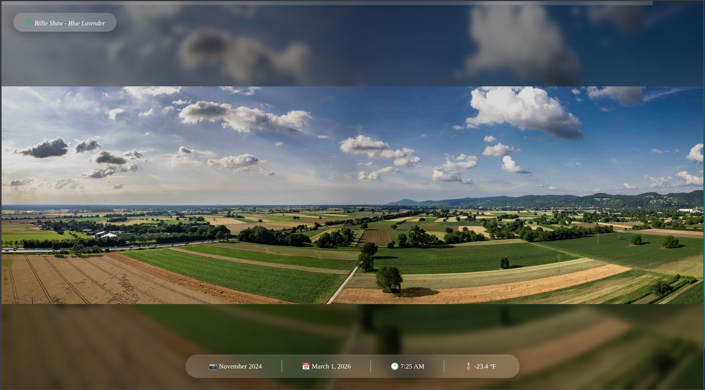

[](https://github.com/rickyphewitt/smplFrm/actions/workflows/ci.yml)
[](https://github.com/psf/black)
___
# smplFrm
*Digital photoframe for displaying photos on any device that has a web browser*




## Run
### Native
* After downloading this repo create a python virtual environment                                                    
  * `make packages`
* Run the required docker services
  * `make docker-services`
* Run the server
  * `python main.py`
* Browse to `http://localhost:8321`
* Add your own assets to the `assets` folder and re-run the server to display your own photos

### Docker
* Build the dockerfile
  * `docker build -t smplFrm .`
* Run the docker file exposing ports
  * `docker run -p 8321:8321`
* Browse to `http://localhost:8321`
* To add your own as assets mount a local volume to the `/app/assets` folder in the image
  * `docker run -p 8321:8321 -v <local/Folder/Path>:/app/assets smpl_frm`
### Docker Compose
* An example compose file exists at [compose.yaml](docker/compose/compose.yaml)
* Essentially you just need to update the `SMPL_FRM_ASSET_DIRECTORIES` and mount a local volume like below
```
services:
    smpl_frm:
        image: dke39vsh3gghs/smplfrm:latest
        ports:
         - "8321:8321"
        environment:
            - SMPL_FRM_LIBRARY_DIRS=/app/library,/app/assets
            - PYTHONUNBUFFERED=1
        volumes:
            - /example/local/library/here:/app/library

```
* Then run `docker-compose up -d` and browse to `http://localhost:8321`

### Docker Hub Labels
Repo: https://hub.docker.com/r/dke39vsh3gghs/smplfrm
* `vX.X.X`
  * Official releases. This is the recommended tag to use.
* `latest`
  * This is the most recent code on `main`. Useful for development and testing.
* `<commit-hash>`
  * For each commit merged into `main` an image is created with the corresponding git hash. Useful for pinning to a specific version outside the release cycle. 

## Development

### Python
This repo uses python 3.14. Ensure you download the following dependencies
* python3.14, pyton3.14-dev
  * You may need to get this from [deadsnakes](https://launchpad.net/~deadsnakes/+archive/ubuntu/ppa) 
* pip3.14
  * This can be dowloaded after downloading python3.14 using get-pip
  * `curl -sS https://bootstrap.pypa.io/get-pip.py | python3.14 `
* python3.14-venv
  * Same note about deadsnakes above

### AI
PR's that include AI generated code is permitted. They undergo the same scrutiny as PR's that are unassisted by AI.
However, there are some additional guidelines that should be used for AI commits:
* To ensure quality and consistent code the AI must adhere to the standards and best practices outlined in the .kiro folder. 
  * While this folder is specific to kiro it by no means that the only agent that can commit PR's to this repo be [kiro](https://kiro.dev/cli/). It just happens to be the one I use. Guidelines are taken from [best practices](https://github.com/awsdataarchitect/kiro-best-practices).  
* The code while written by AI needs to be understood by the author. 
  * The Author must be able to articulate what the code does and the feature/bug/ect it is trying to solve.
* Comments on a PR should *NOT* be generated by AI but by a human. 

### Code Formating
* This repo uses [black](https://pypi.org/project/black/) to format the code
* Run `make pre-commit` to install the pre-commit hook
* To mostly ignore the commit that formatted the repo run `make ignore-format-commit`


### Environment Variables

| Name                                    | Default                            | Description                                                                                                               |
|-----------------------------------------|------------------------------------|---------------------------------------------------------------------------------------------------------------------------|
| `SMPL_FRM_LIBRARY_DIRS`                 | "<settings.py-dir>./../../library" | Comma Separated String of directory paths                                                                                 |
| `SMPL_FRM_IMAGE_FORMATS`                | "jpg,png"                          | Comma Separated String of directory paths                                                                                 |
| `SMPL_FRM_IMAGE_REFRESH_INTERVAL`       | 30000                              | How long to display an image (millis)                                                                                     |
| `SMPL_FRM_IMAGE_TRANSITION_INTERVAL`    | 10000                              | How long to transition the image (millis)                                                                                 |
| `SMPL_FRM_EXTERNAL_PORT`                | 8321                               | Used in Docker when the external port differs from the server port                                                        |
| `SMPL_FRM_HOST`                         | localhost                          | Used when running the application on a server                                                                             |
| `SMPL_FRM_PROTOCOL`                     | "http://"                          | Set to "https://" for ssl                                                                                                 |
| `SMPL_FRM_DISPLAY_DATE`                 | True                               | Display date (Month, Year) of photo. This reads the exif image data                                                       |
| `SMPL_FRM_FORCE_DATE_FROM_PATH`         | True                               | Use the filepath to determine date supports `YYYY/MM` 2024/12                                                             |
| `SMPL_FRM_DISPLAY_CLOCK`                | True                               | Display the Clock                                                                                                         |
| `SMPL_FRM_DISPLAY_WEATHER`              | True                               | Display the Weather. [Weather data by Open-Meteo.com](https://open-meteo.com)                                             |
| `SMPL_FRM_WEATHER_COORDS`               | "63.1786,-147.4661"                | Lat,Long for weather                                                                                                      |
| `SMPL_FRM_WEATHER_TEMP_UNIT`            | "F"                                | `F` for Fahrenheit, `C` for Celsius                                                                                       |
| `SMPL_FRM_WEATHER_PRECIP_UNIT`          | "in"                               | `in` for inches, `mm` for millimeters                                                                                     |
| `SMPL_FRM_WEATHER_WINDSPEED_UNIT`       | "mph"                              | `kmh` kilos per hour, `kn` knots, `ms` meters per second, `mph` miles per hour                                            |
| `SMPL_FRM_TIMEZONE`                     | "America/Los_Angeles"              | TZ Identified from [Wikipedia](https://en.wikipedia.org/wiki/List_of_tz_database_time_zones)                              |
| `SMPL_FRM_IMAGE_CACHE_TIMEOUT`          | "86400"                            | Seconds until the image should be removed from the cache                                                                  |
| `SMPL_FRM_CLEAR_CACHE_ON_BOOT`          | False                              | Clears Cache on Service Boot                                                                                              |
| `SMPL_FRM_IMAGE_FILL_MODE`              | "blur"                             | How to fill aspect ratio gaps: `border` (replicate edges), `blur` (blurred background), or `zoom_to_fill` (zoom to fill)  |
| `SMPL_FRM_IMAGE_ZOOM_EFFECT`            | True                               | Enables slow zoom animation on images from center (1.0x to 1.2x scale over display duration)                              |
| `SMPL_FRM_PLUGINS_SPOTIFY_ENABLED`      | False                              | Enables Spotify Now Playing Plugin                                                                                        |
| `SMPL_FRM_PLUGINS_SPOTIFY_CLIENT_ID`    | None                               | See: https://spotipy.readthedocs.io/en/latest/#getting-started                                                            |
| `SMPL_FRM_PLUGINS_SPOTIFY_CLIENT_SECRET` | None                               | See ^ - Ensure your Redirect URI matches  Http://`SMPL_FRM_HOST`:`SMPL_FRM_EXTERNAL_PORT`/api/v1/plugins/spotify/callback |
| `SMPL_FRM_RESET_IMAGE_VIEW_COUNT`        | False                              | When set to True all image counts are reset.                                                                              |