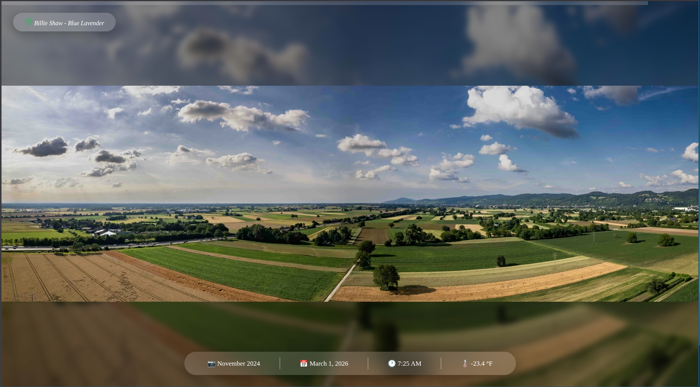

[](https://github.com/rickyphewitt/smplFrm/actions/workflows/ci.yml)
[](https://github.com/astral-sh/ruff)
___

<p align="center">
  
</p>

<p align="center">
  <em>Digital photoframe for displaying photos on any device that has a web browser</em>
</p>




## Run
### Native
* Install [uv](https://docs.astral.sh/uv/getting-started/installation/) (see [Python](#python) below)
* After downloading this repo create the Python virtual environment (`.venv`)
  * `make packages`
* Run the required docker services
  * `make docker-services`
* Run the server
  * `make run`
* Browse to `http://localhost:8321`
* Add your own assets to the `assets` folder and re-run the server to display your own photos

### Docker
The recommended way to run smplFrm is with Docker Compose. The image bundles the web server, Celery worker, and Celery beat into a single container — only Redis is needed as a separate service.

### Docker Compose
Create a `compose.yaml` with the following (or use the one at [docker/compose/compose.yaml](docker/compose/compose.yaml)):
```yaml
services:
    smpl_frm:
        image: dke39vsh3gghs/smplfrm:latest
        ports:
          - "8321:8321"
        environment:
            - SMPL_FRM_LIBRARY_DIRS=/app/library
            - REDIS_HOST=cache
            - REDIS_PASSWORD=change-me
            - PYTHONUNBUFFERED=1
        volumes:
            - /path/to/your/photos:/app/library
        depends_on:
          - cache

    cache:
        image: redis:7.4.1-alpine
        command: sh -c "redis-server --requirepass $$REDIS_PASSWORD"
        environment:
            - REDIS_PASSWORD=change-me
        restart: always
```
Run `docker compose up -d` and browse to `http://localhost:8321`.

For detailed configuration see the [Docker wiki page](https://github.com/rickyphewitt/smplFrm/wiki/Docker).

### Default Passwords

The following environment variables ship with insecure defaults and **must be changed** in any non-development deployment:

| Variable | Default | How to generate a secure value |
|----------|---------|-------------------------------|
| `DJANGO_SECRET_KEY` | `change-me` | `python -c "from django.core.management.utils import get_random_secret_key; print(get_random_secret_key())"` |
| `REDIS_PASSWORD` | `change-me` | `openssl rand -base64 32` |

### Docker Hub Labels
Repo: https://hub.docker.com/r/dke39vsh3gghs/smplfrm
* `vX.X.X`
  * Official releases. This is the recommended tag to use.
* `latest`
  * This is the most recent code on `main`. Useful for development and testing.
* `<commit-hash>`
  * For each commit merged into `main` an image is created with the corresponding git hash. Useful for pinning to a specific version outside the release cycle. 

### Environment variables
For a full list of environment variables see the [Environment Variable wiki page](https://github.com/rickyphewitt/smplFrm/wiki/Environment-Variables)

### API
For the API standard and resource documentation see [docs/API.md](docs/API.md).

## Development

### JavaScript
This project uses [Vitest](https://vitest.dev/) for testing, [ESLint](https://eslint.org/) for linting, and [Prettier](https://prettier.io/) for formatting JavaScript files.

**Setup:**
```bash
make packages-js
```

**Run tests:**
```bash
make test-js              # Run tests once (silent mode)
make test-js-watch        # Watch mode for development
make test-js-coverage     # Generate coverage report
```

**Lint & format:**
```bash
npm run lint              # Check for lint errors
npm run lint:fix          # Auto-fix lint errors
npm run format            # Format all JS files with Prettier
npm run format:check      # Check formatting without writing
```
The pre-commit hook (`make pre-commit`) runs ESLint (`--fix`) and Prettier on staged JS files using the versions in `node_modules`, so run `make packages-js` first. The `Lint JavaScript` CI workflow runs `npm run lint` and `npm run format:check`.

**Test location:** Tests are in `tests/javascript/` to avoid Django static bundling.

### Python
This repo uses Python 3.14 and [uv](https://docs.astral.sh/uv/) to manage the interpreter, virtual environment, and dependencies. `pyproject.toml` declares dependencies and `uv.lock` pins exact versions.

**Install uv** (0.12.18 or newer) using one of the [official methods](https://docs.astral.sh/uv/getting-started/installation/):
```bash
curl -LsSf https://astral.sh/uv/install.sh | sh   # standalone installer
pipx install uv                                   # or pipx
brew install uv                                   # or Homebrew
```
uv downloads Python 3.14 automatically if it is not already installed (version set in `.python-version`).

**Setup and run:**
```bash
make packages             # Create .venv from uv.lock (includes dev tools)
make run                  # Collect static files, migrate, and run the dev server on :8321
make test                 # Run the Python test suite
```

**Dependencies:**
* Add or change dependencies in `pyproject.toml` (dev-only tools go in `[dependency-groups] dev`), then run `make lock` and commit both `pyproject.toml` and `uv.lock`
* `make packages` and the other Python targets fail if `uv.lock` is out of date with `pyproject.toml`
* `make packages-clean` removes `.venv` (and the virtualenv left by the previous pip-based setup)
* Set `UV=/path/to/uv` to use a uv binary that is not on `PATH` (e.g. `make UV=/opt/uv/bin/uv packages`)

**Migrating from the previous pip-based setup:** install uv, then run `make packages-clean packages pre-commit`.

### Code Formatting
* This repo uses [Ruff](https://docs.astral.sh/ruff/) to format (88-column lines) and lint Python code; its version is pinned in `uv.lock` and its settings live in `pyproject.toml`
* Run `make pre-commit` to install the pre-commit hook, which runs `ruff check --fix` and `ruff format` on staged Python files
* `make lint` checks lint and formatting without changing files (the same checks as the `Lint Python` CI workflow)
* `make format` applies lint fixes and formats all Python files
* To mostly ignore the commits that formatted the repo run `make ignore-format-commit`


### Environment Variables

See the [Environment Variables](https://github.com/rickyphewitt/smplFrm/wiki/Environment-Variables) wiki page for the full reference of all application, infrastructure, and plugin environment variables.

## AI
PR's that include AI generated code is permitted. They undergo the same scrutiny as PR's that are unassisted by AI.
However, there are some additional guidelines that should be used for AI commits:
* The code while written by AI needs to be understood by the author. 
  * The Author must be able to articulate what the code does and the feature/bug/ect it is trying to solve.
* Comments on a PR should *NOT* be generated by AI but by a human. 

### AI Guidelines

This project uses a three-layer pattern for AI coding guidelines:

| Layer | Location | Purpose |
|-------|----------|---------|
| Knowledge | `ai/` | Tool-agnostic markdown — single source of truth |
| Adapters | `.kiro/steering/`, `.claude/rules/` | Thin pointers that load knowledge files |
| Personal | `.kiro/steering/local/`, `CLAUDE.local.md` | Gitignored personal overrides |

**Supported tools:** Kiro, Claude Code

| Tool | Adapter Location |
|------|-----------------|
| Kiro | `.kiro/steering/<topic>.md` |
| Claude Code | `.claude/rules/<topic>.md` + `CLAUDE.md` |

**Adding a new topic:** Create `ai/<topic>.md`, then add adapter files for each tool.

**Onboarding a new AI tool:** See [`ai/README.md`](ai/README.md) for step-by-step instructions.