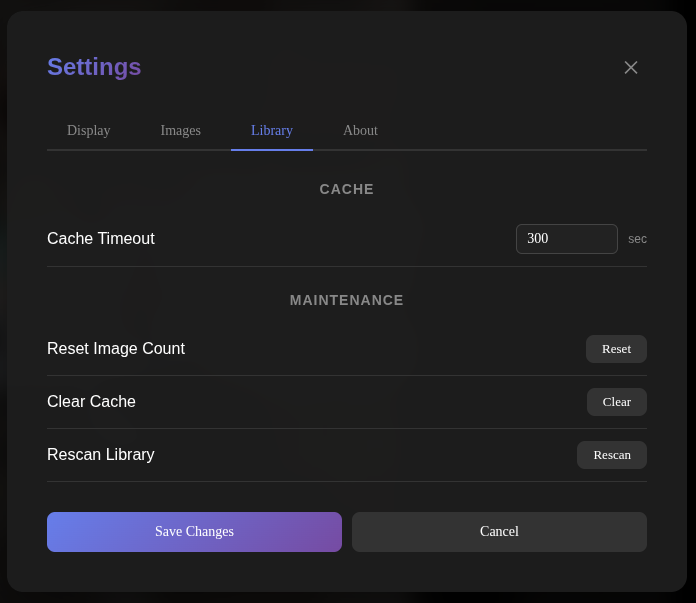
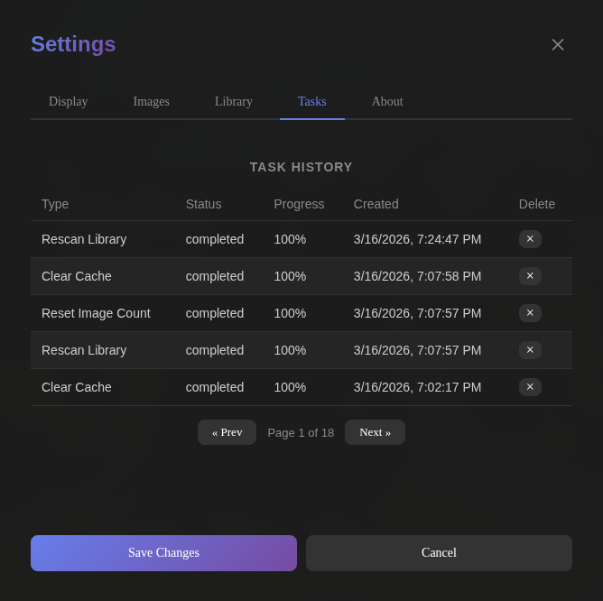

# Settings

The settings modal can be accessed by clicking the SmplFrm icon in the top-right corner of the display. It contains tabs for Display, Images, Library, Tasks, and About.

## Library

The Library tab provides cache configuration and maintenance tasks for managing the photo library.

### Cache

| Setting | Description | Range |
|---------|-------------|-------|
| Cache Timeout | How long (in seconds) a processed image stays in the cache before being evicted. | 0 – 604800 |

### Maintenance

These actions run asynchronously in the background. A progress toast appears in the bottom-right corner while a task is running.

| Action | Description |
|--------|-------------|
| Reset Image Count | Resets the view count for all images back to zero. This causes the display rotation to start fresh. |
| Clear Cache | Clears all cached processed images. Images will be re-processed on next display. |
| Rescan Library | Re-scans the configured library directories for new, removed, or restored images. |

## Tasks

The Tasks tab displays a history of background tasks. Each row shows the task type, status, progress, and creation date. Tasks are sorted newest-first and paginated with 5 per page.

| Column   | Description                                            |
|----------|--------------------------------------------------------|
| Type     | The task name (e.g. Clear Cache, Rescan Library).      |
| Status   | Current state: pending, running, completed, or failed. |
| Progress | Completion percentage (0–100%).                        |
| Created  | Date and time the task was created.                    |
| Delete   | Delete a task.                                         |

Each row includes a delete button (×) that deletes the task. If the task is currently running, it will self-cancel on its next progress check.

Only one task of each type can be pending or running at a time. Attempting to start a duplicate will show an error in the toast.

Tasks that were created more than 7 days ago will be deleted. 