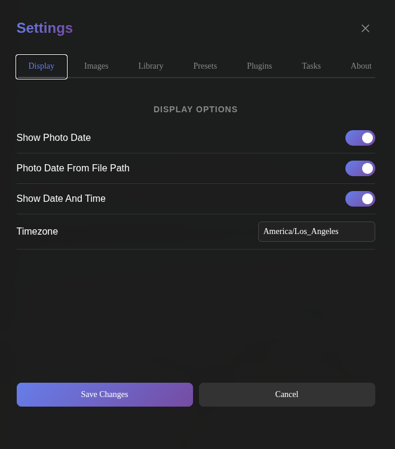
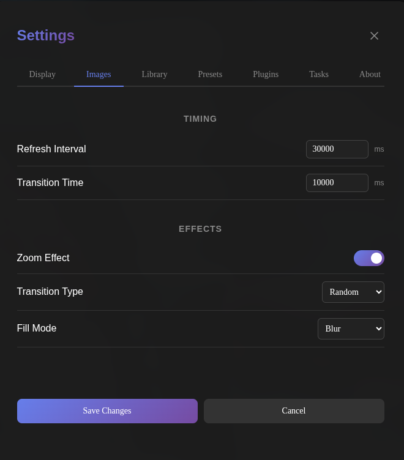
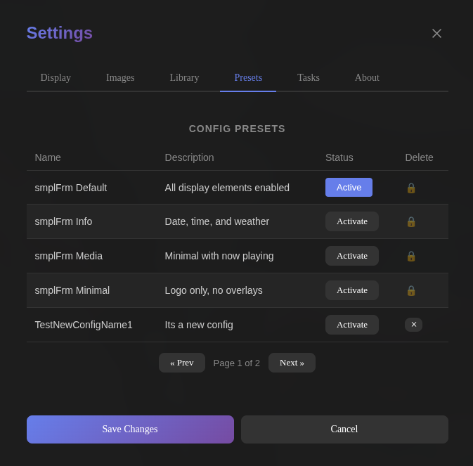
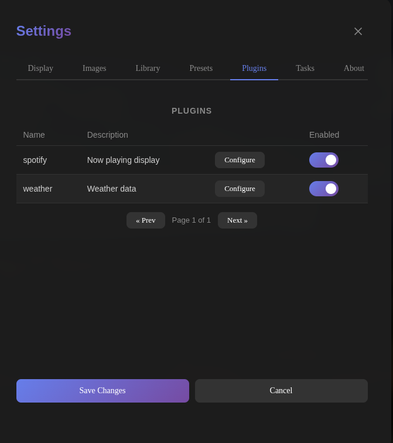
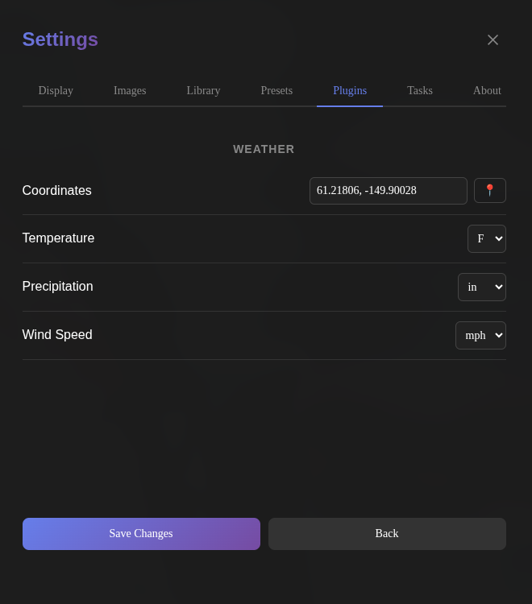

# Settings

The settings modal can be accessed by clicking the SmplFrm icon in the top-right corner of the display. It contains tabs for Display, Images, Library, Presets, Plugins, Tasks, and About.

## Display

The Display tab controls what information is shown on the photo frame overlay.

| Setting | Description |
|---------|-------------|
| Show Photo Date | Display the date (Month, Year) of the photo from EXIF data or file path. |
| Date From File Path | Use the file path (YYYY/MM) to determine the photo date instead of EXIF data. |
| Show Date And Time | Display the current date and time. |
| Timezone | Timezone for the clock display. Searchable input with all IANA timezones. |

## Images

The Images tab controls image display timing, effects, and processing.

### Timing

| Setting | Description | Range |
|---------|-------------|-------|
| Refresh Interval | How long to display an image (milliseconds). | 5 – 300 |
| Transition Time | How long the transition between images takes (milliseconds). | 1000 – 300000 |

### Effects

| Setting | Description |
|---------|-------------|
| Zoom Effect | Enables slow zoom animation on images (1.0x to 1.2x scale over display duration). |
| Transition Type | Image transition effect: Random, Fade, Slide Left, Slide Right, Zoom, or None. |
| Fill Mode | How to fill aspect ratio gaps: Blur (blurred background), Border (replicate edges), or Zoom to Fill. |

## Library

The Library tab provides cache configuration and maintenance tasks for managing the photo library.

### Cache

| Setting | Description | Range |
|---------|-------------|-------|
| Cache Timeout | How long (in seconds) a processed image stays in the cache before being evicted. | 0 – 604800 |

### Maintenance

These actions run asynchronously in the background. A progress toast appears in the bottom-right corner while a task is running.

| Action | Description |
|--------|-------------|
| Reset Image Count | Resets the view count for all images back to zero. This causes the display rotation to start fresh. |
| Clear Cache | Clears all cached processed images. Images will be re-processed on next display. |
| Rescan Library | Re-scans the configured library directories for new, removed, or restored images. |

## Presets

The Presets tab displays all configuration presets and custom configs. It allows switching between configs and managing custom ones. Configs are sorted with the active config first, then system-managed presets, then custom configs. Paginated with 5 per page.

| Column      | Description                                                                                      |
|-------------|--------------------------------------------------------------------------------------------------|
| Name        | The config name. Editable inline for custom configs.                                             |
| Description | A brief description. Editable inline for custom configs.                                         |
| Status      | Shows "Active" badge for the current config, or an "Activate" button to switch to that config.   |
| Delete      | Delete button (×) for inactive custom configs. Lock icon (🔒) for system-managed or active configs. |

### Behavior

- **Activating a config** reloads the page with the new config applied.
- **Editing settings** (Display, Images, Library tabs) while a system-managed config is active automatically creates a custom copy. The original preset is never modified.
- **System-managed presets** (prefixed with `smplFrm`) cannot be edited or deleted. They are synced from JSON files on app startup.
- **Custom configs** can be renamed, have their description edited, and be deleted (if not active).
- A maximum of 10 configs can exist at a time.

## Plugins

The Plugins tab shows all registered plugins with enable/disable toggles and per-plugin configuration.

| Column | Description |
|--------|-------------|
| Name | The plugin name. |
| Description | Brief description of the plugin. |
| Configure | Opens the plugin's settings form. |
| Enabled | Toggle to enable or disable the plugin. Saved with the main Save button. |

### Configure

Clicking Configure opens a detail view with plugin-specific settings. The form fields are defined by each plugin's schema.

#### Spotify

| Setting | Description |
|---------|-------------|
| Client ID | Spotify API client ID. Masked by default with reveal toggle. |
| Client Secret | Spotify API client secret. Masked by default with reveal toggle. |

See [Spotify Developer](https://spotipy.readthedocs.io/en/latest/#getting-started) for setup instructions.

#### Weather

| Setting | Description |
|---------|-------------|
| Coordinates | Lat,Long for weather location. Use 📍 button to open [latlong.net](https://www.latlong.net) for coordinate lookup. |
| Temperature | Temperature unit: F (Fahrenheit) or C (Celsius). |
| Precipitation | Precipitation unit: in (inches) or mm (millimeters). |
| Wind Speed | Wind speed unit: mph, kmh, kn, or ms. |

[Weather data by Open-Meteo.com](https://open-meteo.com)

## Tasks

The Tasks tab displays a history of background tasks. Each row shows the task type, status, progress, and creation date. Tasks are sorted newest-first and paginated with 5 per page.

| Column   | Description                                            |
|----------|--------------------------------------------------------|
| Type     | The task name (e.g. Clear Cache, Rescan Library).      |
| Status   | Current state: pending, running, completed, or failed. |
| Progress | Completion percentage (0–100%).                        |
| Created  | Date and time the task was created.                    |
| Delete   | Delete a task.                                         |

Each row includes a delete button (×) that deletes the task. If the task is currently running, it will self-cancel on its next progress check.

Only one task of each type can be pending or running at a time. Attempting to start a duplicate will show an error in the toast.

Tasks that were created more than 7 days ago will be deleted.

## About

The About tab displays general information about smplFrm and the current application version.
